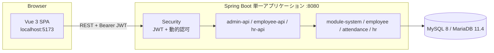

# Manpower Kintai · 勤怠管理システム

社員・部門管理者・人事担当者・システム管理者が利用する勤怠管理システム。勤務表の入力、勤怠申請と多段階承認、部下・社員の参照、入社登録、ロールと権限の管理を扱う。

Vue 3 のフロントエンドと、Spring Boot のマルチモジュールバックエンドで構成する。バックエンドは DDD / ヘキサゴナルアーキテクチャを志向し、業務モジュール間の依存をポートとアダプターで切り離している。

本書はリポジトリ全体の概要をまとめる。各層の詳細は下記の設計書を参照する。

## ドキュメント

| 文書 | 内容 |
| --- | --- |
| [バックエンド アーキテクチャ設計書](manpower-kintai-backend/docs/architecture.md) | モジュール依存、レイヤー、設計規約、認証認可、永続化、業務フロー、既知の課題 |
| [バックエンド API 設計書](manpower-kintai-backend/docs/api-design.md) | 共通レスポンス、エラーコード、ページング、権限ルール、全エンドポイント一覧 |
| [フロントエンド アーキテクチャ設計書](manpower-kintai-frontend/docs/architecture.md) | 画面・ルーティング、状態管理、権限制御、ビルド設定、既知の課題 |
| [フロントエンド API 設計書](manpower-kintai-frontend/docs/api-design.md) | 通信層、エラー処理、API モジュールとエンドポイントの対応 |

読む順序の目安: 初めて環境構築する場合は本書 →「クイックスタート」。バックエンド開発はバックエンドのアーキテクチャ設計書 → API 設計書、フロントエンド開発はフロントエンドのアーキテクチャ設計書 → API 設計書。

## システム構成



- バックエンドの全モジュールは `kintai-starter` が集約し、1 つの JAR として起動する。
- 認可は `sys_permission` に登録した「HTTP メソッド + パスパターン → 権限コード」のルールで動的に判定する。画面のメニュー表示（`sys_menu`）とは独立している。
- フロントエンドはログイン後に `GET /api/system/auth/me` で権限コードとメニューを取得し、ルートガードとメニュー表示に使う。

## 利用者と主な機能

| 利用者 | 機能 | 画面 | API プレフィックス |
| --- | --- | --- | --- |
| 社員 | 月次勤務表の参照・日次記録の保存/削除 | 勤務表 | `/employee/att/timesheet` |
| 社員 | 勤怠申請（有給・残業・振替）の作成・更新・取消 | 勤怠申請 | `/employee/att/requests` |
| 承認者 | 承認待ち・履歴、承認・否認、他の承認者への委譲 | 承認 | `/employee/approvals` |
| 部門管理者 | 配下社員の検索 | 所属社員管理 | `/manager/emp/subordinates` |
| 人事担当者 | 社員一覧、入社登録 | 社員一覧・入社登録 | `/hr/emp/employee`、`/admin/hr/onboarding` |
| システム管理者 | メニュー・権限・ロール（認可）管理 | システム管理 | `/admin/sys/**` |
| システム管理者 | 社員・アカウント・所属・会社・組織・職級・コードマスタ・承認ルール管理 | （画面なし・API のみ） | `/admin/emp/**`、`/admin/org/**`、`/admin/sys/**`、`/admin/wf/**` |
| 全員 | ログイン、通知 | ヘッダー | `/api/system/auth/**`、`/employee/notifications/**` |

勤怠申請を作成すると、申請者の所属組織を上位へたどって承認者を自動決定し、承認ルール（会社・申請種別・申請量ごとの停止条件）に従って多段階の承認ステップを作成する。有給・振替などの申請が有効な日は、勤務表の編集がロックされる。

## 技術スタック

| 領域 | 構成 |
| --- | --- |
| バックエンド | Java 21、Spring Boot 3.4.9、Spring Security、MyBatis-Plus 3.5.7、jjwt 0.11.5、Springdoc OpenAPI 2.3.0、Maven |
| フロントエンド | Vue 3、TypeScript、Vite 8、Pinia、Vue Router、Element Plus、Axios |
| データベース | MySQL 8（既定）。MariaDB 11.4 互換の SQL も同梱 |
| CI | GitHub Actions（バックエンド `verify`、フロントエンド `build`） |
| Node.js | `^20.19.0 \|\| >=22.12.0` |

Maven Wrapper は同梱していない。JDK 21 と Maven を別途用意する。

## クイックスタート

Windows PowerShell、MySQL、バックエンド `8080` / フロントエンド `5173` の例。各ターミナルはリポジトリルートから開始する。

### 1. 開発用データベースを初期化する

**DDL は `DROP TABLE` を含む。再作成してよい開発用 DB にのみ実行する。** スクリプト内で `manpower_kintai` を指定しているため、クライアントの接続先指定では対象 DB を変更できない。

```powershell
mysql -u root -p --default-character-set=utf8mb4
```

```sql
SOURCE manpower-kintai-backend/sql/ddl/V1_init_MYSQL_ddl.sql;
SOURCE manpower-kintai-backend/sql/data/V1_init_MYSQL_data.sql;
```

MariaDB の場合は `V1_init_MARIADB_*.sql` を使う。Flyway / Liquibase は未導入で、起動時の自動マイグレーションは無い。

### 2. バックエンドを起動する

```powershell
Copy-Item manpower-kintai-backend/kintai-starter/src/main/resources/application-dev.example.yml manpower-kintai-backend/kintai-starter/src/main/resources/application-dev.yml
```

作成した `application-dev.yml` の `spring.datasource.url / username / password` を編集する（Git 管理外）。

```powershell
Set-Location manpower-kintai-backend
mvn -B --no-transfer-progress -pl kintai-starter -am clean package -DskipTests
java -jar kintai-starter/target/kintai-starter-0.0.1-SNAPSHOT.jar --spring.profiles.active=dev
```

IDE で起動する場合は `manpower-kintai-backend/pom.xml` を開き、Lombok の注釈処理を有効にして `KintaiStarterApplication` を実行する。

### 3. フロントエンドを起動する

```powershell
Set-Location manpower-kintai-frontend
Copy-Item .env.example .env.development.local
npm ci
npm run dev -- --host localhost --port 5173 --strictPort
```

[http://localhost:5173](http://localhost:5173) を開く。バックエンドの CORS 許可オリジンは `http://localhost:5173` のみのため、ポートを変えるとリクエストが拒否される。

### 4. ログインと API の確認

- 初期データの管理者メールアドレスは `admin@manpower.local`（SUPER_ADMIN）。
- 初期 SQL には BCrypt ハッシュのみが入っており、平文の既定パスワードは文書化していない。必要に応じて開発 DB のアカウントのパスワードハッシュを BCrypt で再設定する。
- 起動後は [Swagger UI](http://localhost:8080/swagger-ui/index.html) と [OpenAPI JSON](http://localhost:8080/v3/api-docs) で API を確認できる。

## ディレクトリ構成

```text
manpower-kintai/
├── README.md                       # 本書（プロジェクト全体の概要）
├── .github/workflows/ci.yml        # バックエンド verify / フロントエンド build
├── manpower-kintai-backend/
│   ├── docs/                       # architecture.md / api-design.md
│   ├── kintai-common/              # 共通 DTO・Result・例外・列挙
│   ├── kintai-framework/           # Security・JWT・動的認可・MyBatis-Plus・例外処理・i18n
│   ├── kintai-module-system/       # ロール・メニュー・権限・コードマスタ・通知・認証
│   ├── kintai-module-employee/     # 社員・アカウント・所属・組織・職級・部下検索
│   ├── kintai-module-attendance/   # 勤務表・勤怠申請・承認フロー・承認ルール
│   ├── kintai-module-hr/           # HR ユースケースとポート（永続化なし）
│   ├── kintai-admin-api/           # /admin/** Controller
│   ├── kintai-employee-api/        # /employee/**・/manager/**・/api/system/auth/** Controller、承認アダプター
│   ├── kintai-hr-api/              # /hr/** Controller、HR アダプター
│   ├── kintai-starter/             # 起動クラス・application*.yml・logback
│   └── sql/                        # ddl / data（MySQL・MariaDB）
└── manpower-kintai-frontend/
    ├── docs/                       # architecture.md / api-design.md
    └── src/                        # api / types / stores / router / views / components ...
```

## ビルドと検証

| 対象 | コマンド | 内容 |
| --- | --- | --- |
| バックエンド（CI と同じ） | `mvn -B --no-transfer-progress -pl kintai-starter -am clean verify -DskipTests` | コンパイル・パッケージ。テストは実行しない |
| バックエンド（テスト実行） | `mvn -B --no-transfer-progress -pl kintai-admin-api,kintai-employee-api -am test` | 既存テストの実行 |
| フロントエンド | `npm run build` | 型検査 + ビルド |
| フロントエンド | `npm run lint` | oxlint + ESLint（自動修正あり） |

CI（`main` / `dev` への push と PR）はバックエンドのテストを実行せず、フロントエンドには自動テストが無い。ビルド成功をテスト成功として扱わない。

## 現在の状態と制約

各設計書の「既知の課題」に詳細を記載している。主なものは次のとおり。

- **HR モジュールは移行途中**: 新 HR API（`/hr/**`）は社員一覧と入社登録が動作するが、入社登録用の選択肢取得は未実装で、画面は旧 API（`/admin/hr/onboarding/options`）を併用している。
- **HR の権限データ未整備**: 初期データに `/hr/**` の権限ルールが無く、SUPER_ADMIN 以外は利用できない。入社登録メニューのパス（`/admin/hr/onboarding`）もフロントエンドのルート（`/hr/onboarding`）と一致していない。
- **管理画面は一部のみ**: 社員・組織・コードマスタ・承認ルール等の管理 API に対応する画面は無い。
- **認証**: サーバー側ログアウト・トークン失効・リフレッシュは未実装。JWT の有効期限は既定 2 時間。
- **運用**: Docker・自動デプロイは無い。`/actuator/health` を許可しているが Actuator 依存は無い。本番は `prod` プロファイルと環境変数（`MYSQL_*`、`JWT_SECRET`）で起動する。

## ドキュメントの更新方針

1. パス・メソッド・入力型は Controller と DTO、業務条件と状態遷移は Service とドメインを根拠とする。コメントや画面名だけで仕様を判断しない。
2. API を変更したらバックエンドとフロントエンドの API 設計書を両方更新し、起動後の `/v3/api-docs` と照合する。
3. モジュール依存・業務フローの変更はアーキテクチャ設計書、コマンド・ポート・環境変数・CI の変更は README に反映する。
4. DB 構造を変更したら MySQL / MariaDB 両方のスクリプトを更新する。初期化 SQL は既存環境への増分マイグレーションとして扱わない。
5. パスワード・トークン・接続情報はプレースホルダーで例示し、実際の値は Git 管理外の設定で扱う。
6. 「既知の課題」は解消したら削除し、実装済みと未実装を混同しない。
