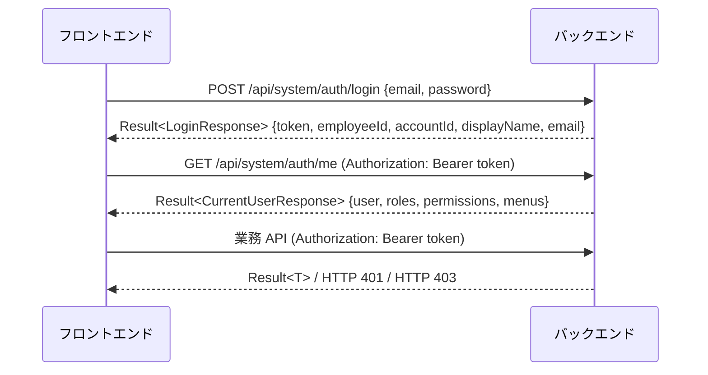

# バックエンド API 設計書

[アーキテクチャ設計書](architecture.md) · [プロジェクト README](../../README.md)

本書は REST API の共通仕様と、現行 Controller に存在するエンドポイントの一覧を記載する。パス・メソッド・入力型は Controller と DTO を根拠とする。個々のフィールド定義の最新状態は起動後の Swagger UI（`/swagger-ui/index.html`）および `/v3/api-docs` で確認する。

## 1. 共通仕様

### 1.1 ベース URL とパス体系

ベース URL は `http://<host>:8080`。コンテキストパスは無く、**全 API に `/api` が付くわけではない**。

| プレフィックス | 利用者 | 実装モジュール |
| --- | --- | --- |
| `/api/system/auth` | 全ユーザー（認証） | `kintai-employee-api` |
| `/employee/**` | 社員本人（自己情報・勤務表・申請・承認・通知） | `kintai-employee-api` |
| `/manager/**` | 部門管理者（部下参照） | `kintai-employee-api` |
| `/admin/**` | システム管理者（マスタ・権限・組織・社員管理） | `kintai-admin-api` |
| `/hr/**` | 人事担当者（社員一覧・入社登録） | `kintai-hr-api` |

パス命名: `/<利用者>/<業務領域>/<リソース複数形>`。業務領域は `sys`（システム）、`emp`（社員）、`org`（組織）、`att`（勤怠）、`wf`（ワークフロー）、`hr`（人事）。状態変更は `PUT /{id}/enable`、`PUT /{id}/disable` のようにサブリソースで表現し、承認系のアクションは `POST /{id}/approve` のように動詞サブパスを使う。

### 1.2 リクエストヘッダー

| ヘッダー | 必須 | 内容 |
| --- | --- | --- |
| `Authorization` | ログイン API 以外 | `Bearer <JWT>` |
| `Content-Type` | ボディあり | `application/json` |
| `Accept-Language` | 任意 | メッセージのロケール（`ja` 既定、`en`、`zh-CN`） |
| `X-Trace-Id` | 任意 | 指定時はその値でログを関連付ける。未指定時はサーバーが採番する |

レスポンスには常に `X-Trace-Id` ヘッダーが付く。

### 1.3 レスポンス形式

すべての Controller は `Result<T>` を返す。`null` のフィールドは出力しない。

```json
{
  "code": 200,
  "message": "success.ok",
  "data": { },
  "timestamp": 1760000000000
}
```

| フィールド | 型 | 内容 |
| --- | --- | --- |
| `code` | number | 業務結果コード。成功は `200` |
| `message` | string | メッセージ。成功時は i18n キー `success.ok`、エラー時は翻訳済みメッセージ |
| `data` | any | 結果データ。バリデーションエラー時は `ValidationErrors` |
| `timestamp` | number | サーバー生成時刻（エポックミリ秒） |
| `detail` | string | エラー詳細。**prod プロファイルでは出力しない** |
| `traceId` | string | 定義はあるが、現状の例外ハンドラは設定していない（ヘッダー `X-Trace-Id` を使う） |

### 1.4 HTTP ステータスと業務コード

**アプリケーション層のエラーは HTTP 200 で返し、`code` に結果を入れる。** HTTP ステータスが 401 / 403 になるのは Spring Security のフィルタ段階で拒否された場合のみ。

| 発生箇所 | HTTP | ボディ |
| --- | --- | --- |
| 正常 | 200 | `code: 200` |
| Controller / Service の例外（`GlobalExceptionHandler`） | 200 | `code` にエラーコード |
| 未認証（トークン無し・無効・期限切れ） | 401 | `{"code":401,"message":"認証エラー"}` |
| 認可拒否（権限ルール不一致） | 403 | `{"code":403,"message":"権限がありません"}` |

クライアントは「HTTP ステータス」と「`code`」の両方を確認する必要がある。ログイン失敗（`error.auth.invalid_credentials`）は HTTP 200 + `code: 401` で返るため、HTTP 401 とは区別される。

### 1.5 エラーコード

| code | ErrorCode | 主な発生条件 |
| --- | --- | --- |
| 400 | `BAD_REQUEST` | ボディ解析失敗、必須クエリパラメータ不足（`error.missing_param`） |
| 401 | `UNAUTHORIZED` / `AuthErrorCode.INVALID_CREDENTIALS` | 認証情報不正、社員プロファイル取得不可 |
| 403 | `FORBIDDEN` / `AuthErrorCode.ACCOUNT_DISABLED` | 業務上の操作権限なし（他人の承認、他社への入社登録等）、アカウント無効 |
| 404 | `NOT_FOUND` | 対象データ無し、存在しない URL |
| 405 | `METHOD_NOT_ALLOWED` | HTTP メソッド不一致 |
| 409 | `CONFLICT` | 一意制約違反、承認ルート解決不可、勤務表ロック、委譲先不正 |
| 409 | `BIZ_ERROR` | `BizException` にコード指定が無い業務エラー |
| 413 | - | アップロードサイズ超過（上限 20MB） |
| 415 | `UNSUPPORTED_MEDIA_TYPE` | Content-Type 不正 |
| 422 | `VALIDATION_ERROR` | `@Valid` / `@Validated` の入力検証エラー |
| 500 | `SERVER_ERROR` | 想定外例外 |

`ErrorCode` にはファイル・Excel・インポート関連（`FILE_*`、`SHEET_MISSING`、`HEADER_*`、`IMPORT_*` 等）も定義されているが、現行 API では使用していない。

一意制約違反のうち `uk_role_code`、`uk_permission_code`、`uk_user_email`、`uk_user_role`、`uk_role_perm` は専用の日本語メッセージ、それ以外は `error.conflict` の翻訳を返す。

### 1.6 バリデーションエラー

`code: 422`（必須クエリパラメータ不足は `400`）。`data.errors` に項目別のエラーを返す。

```json
{
  "code": 422,
  "message": "入力内容に誤りがあります",
  "data": {
    "errors": [
      { "field": "email", "key": "NotBlank", "message": "メールアドレスは必須です", "args": ["email"] }
    ]
  },
  "detail": "入力検証エラー（1件）"
}
```

`message` の文言は `messages*.properties` の `error.validation` の翻訳に依存する（上記は例）。

### 1.7 ページング

2 種類のページ形式が存在する。どちらを返すかはエンドポイントごとに異なる。

| 形式 | フィールド | 主な利用箇所 |
| --- | --- | --- |
| `PageResult<T>` | `records`、`total`、`page`、`size`、`pages` | 管理系一覧（社員・会社・ロール・権限・コードマスタ）、通知、委譲候補 |
| `JoinPageResult<T>` | `records`、`total`、`pageNum`、`pageSize`、`pages` | 結合検索（部下一覧、HR 社員一覧） |

リクエストは `page`（1 始まり）と `size` をクエリパラメータで渡す。`PageRequest` は `size` を 1〜100 に補正する。

### 1.8 データ形式

| 型 | 形式 | 例 |
| --- | --- | --- |
| 日付 | `yyyy-MM-dd` | `2026-09-29` |
| 時刻 | `HH:mm`（勤務表・申請） | `09:00` |
| 日時 | `yyyy-MM-dd HH:mm:ss`（`spring.mvc.format`）、タイムゾーン `Asia/Tokyo` | `2026-09-29 18:00:00` |
| ID | 数値（Long） | `1001` |
| 有効/無効 `Status` | 数値 | `1` = 有効、`0` = 無効 |

主要な列挙値（JSON では code 文字列/数値で送受信する）:

| 列挙 | 値 |
| --- | --- |
| `RequestType`（申請種別） | `PAID_LEAVE`、`OVERTIME`、`SUBSTITUTE`、`BUSINESS_TRIP`、`LEAVE_OF_ABSENCE`。作成可能は `PAID_LEAVE` / `OVERTIME` / `SUBSTITUTE` |
| `ApprovalStatus`（承認状態） | `PENDING`、`APPROVED`、`REJECTED`、`CANCELLED` |
| `AttendanceType`（出勤区分） | `OFFICE`、`REMOTE`、`BUSINESS_TRIP`、`HOLIDAY_WORK` |
| `AttRecordStatus`（勤務記録状態） | `0` = DRAFT、`1` = SUBMITTED、`2` = LOCKED |
| `ApprovalStopCondition`（承認停止条件） | `DIRECT_ONLY`、`REACH_GRADE`、`REACH_DEPARTMENT` |

## 2. 認証・認可

### 2.1 ログインからリクエストまで



- トークン有効期限は既定 7200 秒。リフレッシュ API は無く、期限切れ後は HTTP 401 になるため再ログインする。
- `POST /api/system/auth/logout` はサーバー側で処理を行わない。クライアントがトークンを破棄する。

### 2.2 認可ルール

- `ROLE_SUPER_ADMIN` はすべての API を通過する。
- 認証のみで通過: `GET /api/system/auth/me`、`POST /api/system/auth/logout`、`/employee/notifications/**`。
- それ以外は `sys_permission`（`method` + `path` の Ant パターン + `code`）のルールで判定する。例: `GET /employee/att/timesheet/**` → `employee:timesheet:read`。
- 新しい API を追加した場合は、`sys_permission` にルールを登録し、対象ロールへ割り当てないと SUPER_ADMIN 以外は 403 になる。

### 2.3 初期データの主な権限コード

| 権限コード | メソッド | パス |
| --- | --- | --- |
| `employee:timesheet:read` / `write` / `delete` | GET / PUT / DELETE | `/employee/att/timesheet/**`、`/employee/att/timesheet/*` |
| `employee:request:read` / `create` / `update` / `cancel` | GET / POST / PUT / POST | `/employee/att/requests`、`/employee/att/requests/*`、`/employee/att/requests/*/cancel` |
| `manager:approval:read` | GET | `/employee/approvals/**` |
| `manager:approval:approve` / `reject` / `delegate` | POST | `/employee/approvals/*/approve` 等 |
| `manager:approval:delegate-search` | GET | `/employee/approval-delegates` |
| `manager:subordinate:read` | GET | `/manager/emp/subordinates/**` |
| `hr:onboarding:options` | GET | `/admin/hr/onboarding/options` |
| `hr:employee:onboard` | POST | `/admin/hr/onboarding/employees`（Controller 未公開） |
| `admin:menu:*`、`admin:permission:*`、`admin:role:*` | GET / POST / PUT / DELETE | `/admin/sys/menus/**`、`/admin/sys/permissions/**`、`/admin/sys/roles/**` |

`/hr/**` および `/admin/emp/**`、`/admin/org/**` 等のルールは初期データに含まれない（SUPER_ADMIN のみ利用可能）。

## 3. エンドポイント一覧

「本人」はログインユーザー（JWT の社員 ID）を対象とし、クライアントから社員 ID を受け取らないことを示す。

### 3.1 認証 `/api/system/auth`

| メソッド | パス | 入力 | 出力 | 説明 |
| --- | --- | --- | --- | --- |
| POST | `/login` | `LoginRequest {email, password}` | `LoginResponse` | ログイン。認証不要 |
| POST | `/logout` | - | - | 何もしない（クライアント側破棄） |
| GET | `/me` | - | `CurrentUserResponse` | 本人のプロファイル・ロール・権限コード・メニュー |

### 3.2 社員向け `/employee`

**勤務表** `/employee/att/timesheet`

| メソッド | パス | 入力 | 出力 | 説明 |
| --- | --- | --- | --- | --- |
| GET | （ルート） | `year`, `month`（必須） | `TimesheetMonthResponse` | 本人の月次勤務表（日別明細・勤務日数・総労働分・総残業分） |
| PUT | （ルート） | `TimesheetSaveRequest {workDate, attendanceType, clockIn, clockOut, breakMinutes(0-480), remark}` | - | 本人の日次記録を保存（新規/更新）。申請ロック日は 409 |
| DELETE | `/{recordId}` | - | - | 本人の日次記録を削除 |

**勤怠申請** `/employee/att/requests`

| メソッド | パス | 入力 | 出力 | 説明 |
| --- | --- | --- | --- | --- |
| GET | （ルート） | - | `AttRequestResponse[]` | 本人の申請一覧 |
| POST | （ルート） | `AttRequestCreateRequest` | `AttRequestResponse` | 申請作成と承認フロー開始 |
| PUT | `/{requestId}` | `AttRequestUpdateRequest` | `AttRequestResponse` | 本人の申請内容更新 |
| POST | `/{requestId}/cancel` | - | - | 本人の申請取消（承認ステップも取消） |

`AttRequestCreateRequest` / `AttRequestUpdateRequest`: `requestType`（必須）、`startDate` / `endDate`（必須）、`startTime` / `endTime`（`HH:mm`）、`days`（> 0）、`minutes`（0〜1440）、`reason`（500 文字以内）。

**承認** `/employee/approvals`

| メソッド | パス | 入力 | 出力 | 説明 |
| --- | --- | --- | --- | --- |
| GET | `/pending` | - | `ApprovalInboxItem[]` | 本人が現在の承認者である承認待ち一覧 |
| GET | `/history` | - | `ApprovalHistoryItem[]` | 本人が関与した承認履歴 |
| GET | `/{approvalId}` | - | `ApprovalDetailResponse` | 承認詳細（ステップ一覧含む） |
| POST | `/{approvalId}/approve` | `{comment}`（500 文字以内） | - | 承認 |
| POST | `/{approvalId}/reject` | `{comment}` | - | 否認 |
| POST | `/{approvalId}/delegate` | `{targetApproverId}`（必須） | - | 他の承認権限者へ委譲 |

| メソッド | パス | 入力 | 出力 | 説明 |
| --- | --- | --- | --- | --- |
| GET | `/employee/approval-delegates` | `keyword`, `page`(=1), `size`(=20) | `PageResult<ApprovalDelegateCandidateResponse>` | 同一会社の委譲候補（承認権限者）検索 |

**本人情報・参照マスタ**

| メソッド | パス | 出力 | 説明 |
| --- | --- | --- | --- |
| GET | `/employee/emp/account` | `AccountResponse` | 本人アカウント |
| PUT | `/employee/emp/account/password` | - | パスワード変更 |
| GET / PUT | `/employee/emp/profile` | `EmpEmployee` | 本人プロファイル取得・更新 |
| GET | `/employee/emp/positions` | `EmpEmployeePosition[]` | 本人の所属一覧 |
| GET | `/employee/emp/positions/primary` | `EmpEmployeePosition` | 本人の主所属 |
| GET | `/employee/org/companies`、`/{id}` | `OrgCompany[]` / `OrgCompany` | 有効な会社 |
| GET | `/employee/org/nodes?companyId=`、`/{id}` | `OrgNode[]` / `OrgNode` | 有効な組織ノード |
| GET | `/employee/org/grades?companyId=`、`/{id}` | `OrgGrade[]` / `OrgGrade` | 職級 |
| GET | `/employee/sys/enum-types`、`/code/{code}` | `SysEnumType[]` / `SysEnumType` | 有効なコード種別 |
| GET | `/employee/sys/enum-values?enumTypeCode=` | `SysEnumValue[]` | コード値 |
| GET | `/employee/sys/menus` | `SysMenu[]` | 本人のメニュー |

**通知** `/employee/notifications`（認証のみで利用可）

| メソッド | パス | 入力 | 出力 |
| --- | --- | --- | --- |
| GET | `/unread-count` | - | `number` |
| GET | `/unread` | `page`, `size` | `PageResult<SysNotificationResponse>` |
| PUT | `/read` | `{ids: number[]}` | - |

### 3.3 部門管理者向け `/manager`

| メソッド | パス | 入力 | 出力 | 説明 |
| --- | --- | --- | --- | --- |
| GET | `/manager/emp/subordinates/options` | - | `SubordinateFilterOptionsResponse` | 検索用の選択肢（組織・職級等） |
| GET | `/manager/emp/subordinates` | `keyword`, `nodeId`, `gradeId`, `status`, `page`(=1), `size`(=10, ≤100) | `JoinPageResult<SubordinateEmployeeResponse>` | 本人配下の社員検索。管理者 ID はサーバー側でログインユーザーから設定 |

### 3.4 人事向け `/hr`

| メソッド | パス | 入力 | 出力 | 説明 |
| --- | --- | --- | --- | --- |
| GET | `/hr/emp/employee` | `companyId`, `keyword`, `nodeId`, `gradeId`, `status`, `page`(=1), `size`(=10, ≤100) | `JoinPageResult<EmployeeDirectoryResponse>` | 社員一覧 |
| GET | `/hr/emp/employee/options` | - | `SubordinateFilterOptionsResponse` | **暫定**。上長向けサービスの選択肢を返す |
| POST | `/hr/emp/employee/register` | `EmployeeRegisterRequest` | `EmployeeRegisterResponse` | 入社登録（社員・アカウント・所属・ロール作成） |

`EmployeeRegisterRequest`: `companyId`、`employeeCode`（≤50）、`lastName` / `firstName`（≤50）、`lastNameKana` / `firstNameKana`（任意）、`email`（≤100）、`phone`（任意、≤20）、`gender`（任意）、`hireDate`、`nodeId`、`gradeId`、`roleIds`（1 件以上）、`username`（≤50）、`password`（8〜100）。操作者と異なる会社への登録は SUPER_ADMIN 以外 403。

### 3.5 管理者向け `/admin`

管理系リソースは共通して以下の CRUD 形を持つ（リソースにより一部のみ）。

| メソッド | パス | 説明 |
| --- | --- | --- |
| GET | `/` | 一覧（ページング or 全件） |
| GET | `/{id}` | 詳細 |
| POST | `/` | 作成（`*CreateRequest`） |
| PUT | `/{id}` | 更新（`*UpdateRequest`） |
| PUT | `/{id}/enable`、`/{id}/disable` | 有効化・無効化 |
| DELETE | `/{id}` | 削除（論理削除） |

| リソース | ベースパス | 共通 CRUD 以外のエンドポイント |
| --- | --- | --- |
| 社員 | `/admin/emp/employees` | `GET /search`（検索付きページング） |
| アカウント | `/admin/emp/accounts` | `GET /by-employee/{employeeId}`。一覧 API は無い |
| 所属 | `/admin/emp/positions` | `GET ?employeeId=`（有効な所属）、`GET /history?employeeId=`（全履歴）、`PUT /{id}/terminate`（所属終了）。enable/disable は無い |
| 会社 | `/admin/org/companies` | `GET /enabled` |
| 組織ノード | `/admin/org/nodes` | `GET /tree?companyId=` |
| 職級 | `/admin/org/grades` | `GET /list?companyId=` |
| ロール | `/admin/sys/roles` | `GET /list?companyId=`、`GET /{id}/authorization`、`PUT /{id}/authorization`（メニュー・権限の一括保存）、`PUT /{id}/menus`、`PUT /{id}/permissions` |
| メニュー | `/admin/sys/menus` | `GET` は全件ツリー用リスト、`PUT /{id}/show`、`PUT /{id}/hide` |
| 権限 | `/admin/sys/permissions` | - |
| 社員ロール | `/admin/sys/employee-roles` | `GET ?employeeId=`、`POST`（付与）、`PUT /{id}`、`DELETE /{id}`（剥奪）。enable/disable は無い |
| コード種別 | `/admin/sys/enum-types` | `GET /enabled`、`GET /code/{code}` |
| コード値 | `/admin/sys/enum-values` | `GET ?enumTypeCode=` |
| 国際化データ | `/admin/sys/i18n` | `GET`（参照先で検索）、`POST`（upsert）、`DELETE /{id}`、`DELETE /by-ref` |
| 通知 | `/admin/sys/notification` | `POST`（作成）、`GET /unread-count`、`GET /unread`、`PUT /read` |
| 承認ルール | `/admin/wf/approval-rules` | `GET ?companyId=`、パス変数は `{ruleId}` |
| 入社登録（旧） | `/admin/hr/onboarding` | `GET /options?companyId=` のみ。登録 API はコメントアウト済み |

## 4. 主要業務フローと API の組み合わせ

| 業務 | API の順序 | 主なエラー |
| --- | --- | --- |
| ログイン | `POST /api/system/auth/login` → `GET /api/system/auth/me` | `code 401`（資格情報不正）、`code 403`（アカウント無効） |
| 勤務表入力 | `GET /employee/att/timesheet?year&month` → `PUT /employee/att/timesheet` / `DELETE /{recordId}` | `code 409`（申請でロックされた日） |
| 勤怠申請 | `POST /employee/att/requests` → 承認者に通知 → `GET /employee/att/requests` で状態確認 → 必要に応じて `POST /{id}/cancel` | `code 409`（承認ルート解決不可）、`code 422`（入力不正） |
| 承認 | `GET /employee/approvals/pending` → `GET /{approvalId}` → `POST /{approvalId}/approve` or `/reject` | `code 403`（現在の承認者でない）、`code 404` |
| 承認委譲 | `GET /employee/approval-delegates?keyword=` → `POST /employee/approvals/{id}/delegate` | `code 409`（本人・申請者・他社・権限なしへの委譲） |
| 部下参照 | `GET /manager/emp/subordinates/options` → `GET /manager/emp/subordinates` | HTTP 403（権限なし） |
| 入社登録 | `GET /admin/hr/onboarding/options` → `POST /hr/emp/employee/register` | `code 403`（他社）、`code 422`（組織・職級不整合）、`code 409`（一意制約） |
| ロール権限設定 | `GET /admin/sys/roles/{id}/authorization` → `PUT /admin/sys/roles/{id}/authorization` | `code 409`（重複） |

## 5. 新規 API 追加時のチェックリスト

1. 利用者に応じたプレフィックスと API モジュールに Controller を置く（`/employee` `/manager` → employee-api、`/admin` → admin-api、`/hr` → hr-api）。
2. 戻り値は `Result<T>`。レスポンスはドメインエンティティではなく Response DTO を返す。
3. ログインユーザーに紐づくデータは `@AuthenticationPrincipal LoginPrincipal` から社員 ID を取得し、クライアント入力で受け取らない。
4. 入力は `@Valid` とメッセージ付き制約で検証し、業務エラーは `BizException.withDetail(ErrorCode.X, "...")` で送出する。
5. `sys_permission` に `method` + `path` + `code` のルールを追加し、MySQL / MariaDB 両方の初期データとロール割当を更新する。
6. フロントエンドの API モジュール・型定義・ルートの `meta.permission` を更新する（[フロントエンド API 設計書](../../manpower-kintai-frontend/docs/api-design.md)）。
7. 本書のエンドポイント一覧を更新し、`/v3/api-docs` と照合する。

## 6. 現状の制約

- `/hr/**` 用の権限ルールが初期データに無い（SUPER_ADMIN のみ利用可）。
- `/hr/emp/employee/options` は暫定実装で、入社登録用の選択肢（会社・組織・職級・ロール）ではない。フロントエンドの入社登録画面は旧 API `/admin/hr/onboarding/options` を利用している。
- 例外時の `Result.traceId` は未設定。調査にはレスポンスヘッダー `X-Trace-Id` を使う。
- Security の 401 / 403 レスポンスは固定の日本語文字列で、i18n・`timestamp` を含まない。
- ページング形式が 2 種類ある（1.7 参照）。
