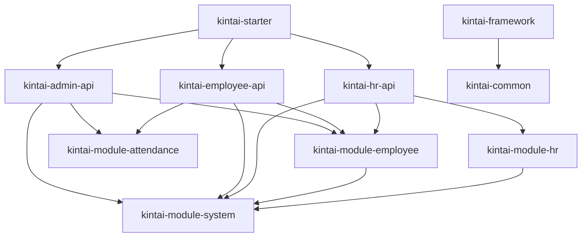
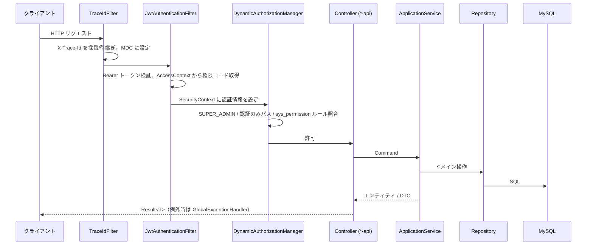
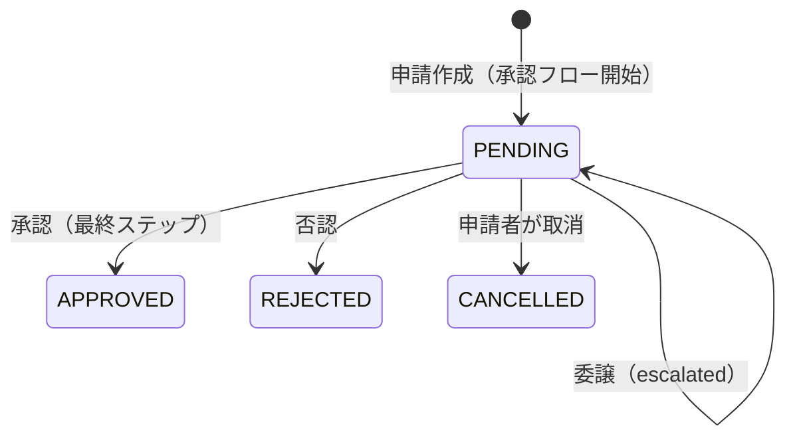

# バックエンド アーキテクチャ設計書

[API 設計書](api-design.md) · [プロジェクト README](../../README.md)

本書は `manpower-kintai-backend` の現行実装に基づくモジュール構成・責務・依存関係・処理フローを説明する。根拠はソースコード（`pom.xml`、Controller、Service、Repository、設定ファイル）であり、計画中の内容は「未実装・既知の課題」に分けて記載する。

## 1. 全体像

- Java 21 / Spring Boot 3.4.9 / Spring Security / MyBatis-Plus 3.5.7 / Maven マルチモジュール
- すべてのモジュールを `kintai-starter` が集約し、**単一の Spring Boot アプリケーション（既定ポート 8080）** として起動する。`*-api` モジュールは個別起動しない。
- コンポーネントスキャンは `@SpringBootApplication(scanBasePackages = "com.manpowergroup.kintai")` による一括スキャン。
- 業務モジュールは DDD / ヘキサゴナルアーキテクチャを志向し、`application / domain / infrastructure` の 3 層に分ける。モジュール間の依存はポート（インターフェース）と上位アダプターで切り離す。

## 2. モジュール構成

| モジュール | 種別 | 責務 |
| --- | --- | --- |
| `kintai-common` | 共通 | `Result`、`PageResult` / `JoinPageResult` / `PageRequest`、`ErrorCode` / `BizException`、共通列挙（`Status`、`AttendanceType`、`PermissionHttpMethod`）、認証 DTO、ユーティリティ |
| `kintai-framework` | 基盤 | Spring Security 設定、JWT 発行・検証、動的認可、MyBatis-Plus 設定、グローバル例外処理、i18n、Trace ID、Swagger |
| `kintai-module-system` | 業務 | ロール・メニュー・権限・社員ロール、コードマスタ（列挙型・列挙値）、国際化データ、通知、認証・アクセスコンテキスト |
| `kintai-module-employee` | 業務 | 社員・アカウント・所属（ポジション）、会社・組織ノード（閉包テーブル）・職級、部下検索、社員一覧クエリ、旧入社登録 |
| `kintai-module-attendance` | 業務 | 勤務表（日次記録）、勤怠申請、承認フロー（承認・否認・委譲）、承認ルール、有給残高・月次集計エンティティ |
| `kintai-module-hr` | 業務 | HR ユースケース（社員一覧・入社登録）。永続化を持たず、他モジュールへのアクセスはすべてポート経由 |
| `kintai-admin-api` | API | 管理者向け REST Controller（`/admin/**`） |
| `kintai-employee-api` | API | 社員・上長向け REST Controller（`/employee/**`、`/manager/**`）、認証入口（`/api/system/auth/**`）、承認ポートのアダプター |
| `kintai-hr-api` | API | HR 向け REST Controller（`/hr/**`）、HR ポートのアダプター・アセンブラー |
| `kintai-starter` | 起動 | 起動クラス、全モジュール集約、`application*.yml`、`logback-spring.xml`、MySQL ドライバ |

### 2.1 モジュール依存関係

`pom.xml` 上の社内モジュール依存（`kintai-common` / `kintai-framework` への依存は全業務・API モジュール共通のため省略）。



依存ルール:

- `kintai-module-attendance` は他の業務モジュールに依存しない。組織・社員情報が必要な処理はポート（`ApprovalRouteResolver` 等）として定義し、実装は `kintai-employee-api` のアダプターが提供する。
- `kintai-module-hr` は `kintai-module-employee` を import しない。社員データへのアクセスは `application/port/emp/` の `*Provider` で定義し、実装は `kintai-hr-api` の `*ProviderAdapter` が提供する。
- `kintai-module-employee` は `kintai-module-system` に依存し、system が定義するポート `EmployeeIdentityProvider` を `employee/adapter/auth/EmployeeIdentityProviderImpl` で実装する。
- API モジュール同士は依存しない。

## 3. 業務モジュール内部のレイヤー

```text
<module>/
├── application/
│   ├── assembler/   # Request/Command/Entity/Response の変換（手書き）
│   ├── command/     # ユースケース入力（record）
│   ├── dto/         # request / response（Swagger @Schema 付き）
│   ├── query/       # 参照系の検索条件・クエリリポジトリ IF
│   ├── port/        # 他モジュール・外部への出口ポート
│   └── service/     # ユースケース IF と impl
├── domain/
│   ├── entity/      # 集約ルート・エンティティ（@TableName 付き充血モデル）
│   ├── enums/       # 業務列挙
│   ├── model/       # エンティティ以外のドメインモデル
│   ├── repository/  # リポジトリ IF（MyBatis-Plus 型を含めない）
│   └── service/     # ドメインサービス（例: TimesheetEditLockPolicy）
└── infrastructure/
    ├── mapper/      # MyBatis-Plus Mapper（BaseMapper / XML）
    └── repository/  # リポジトリ実装（Wrapper 等はここに閉じ込める）
```

| 層 | 責務 | 置いてよいもの |
| --- | --- | --- |
| API（`*-api` の controller） | HTTP 入出力、`@Valid`、ログインユーザーの注入、Request → Command 変換 | `Result`、Request/Response、Assembler |
| application | ユースケースの調整、トランザクション境界、業務チェックと例外送出 | `@Transactional`、ポート呼び出し、ドメインメソッド呼び出し |
| domain | 業務規則・状態遷移 | エンティティのファクトリ・業務メソッド、リポジトリ IF |
| infrastructure | 永続化 | `LambdaQueryWrapper`、Mapper、SQL XML |

### 3.1 設計規約

- **Repository パターン**: MyBatis-Plus の `ServiceImpl` / `IService` 継承をやめ、ドメインのリポジトリ IF + `RepositoryImpl` に統一する（`src/main` に継承の残存は無い）。attendance モジュールが参照実装。
- MyBatis-Plus の型（`Wrappers`、`LambdaQueryWrapper` 等）は `RepositoryImpl` 内に閉じ込め、ドメインのリポジトリ IF には出さない。`Command` をリポジトリのシグネチャに使わない。
- 共通の `BaseRepositoryImpl` は作らない。各 `RepositoryImpl` は対応する Mapper を直接注入する。
- リポジトリは純粋なデータアクセスのみ。入力検証と例外送出は `ServiceImpl` の責務。空コレクションのガードは `RepositoryImpl` で行い、`existsByXxx` は `> 0` 比較を内部で吸収する。
- メソッド命名: `動詞 + By + 条件(And 連結) + 修飾`。動詞は `list` / `find`（単件は `Optional`）/ `exists` / `count` / `save` / `update` / `deleteById`。`select*` 等の SQL 由来名は使わない。更新時重複チェックは `ExcludingId`、コレクション引数は `Ids`、単一外部キーは `Id` を省略（例: `listByMenu`）。
- `Entity` 接尾辞は `@TableName`・静的ファクトリ・業務メソッド・`@Setter(PRIVATE)` を持つ充血モデルに限定し、DTO やエントリ型には使わない。
- ポート命名: モジュール間の事実取得は `*Provider`、通知や外部システムへの委譲は `*Port`。ポートの契約型は `@Schema` を付けない素の record とする。
- `new LambdaQueryWrapper<T>()` を使う。アセンブラーは手書き（MapStruct は依存に含むが現状未使用）。

### 3.2 ポートとアダプターの対応

| ポート（定義モジュール） | 実装（アダプター） | 用途 |
| --- | --- | --- |
| `EmployeeIdentityProvider`（system） | `EmployeeIdentityProviderImpl`（module-employee） | ログイン識別情報・社員プロファイル取得 |
| `ApprovalRouteResolver`（attendance） | `EmployeeApprovalRouteResolver`（employee-api） | 組織階層から承認者リストを解決 |
| `ApprovalDelegateValidator`（attendance） | `EmployeeApprovalDelegateValidator`（employee-api） | 委譲先社員の妥当性検証 |
| `ApprovalNotificationPort`（attendance） | `SystemApprovalNotificationAdapter`（employee-api） | 申請・承認・否認・委譲の通知作成 |
| `EmployeeDirectoryProvider`（hr） | `EmployeeDirectoryProviderAdapter`（hr-api） | 社員一覧のページング取得 |
| `EmployeeRegisterProvider`（hr） | `EmployeeRegisterProviderAdapter`（hr-api） | 入社登録（社員・アカウント・所属・ロールの一括作成） |
| `EmployeeRegisterValidationProvider`（hr） | `EmployeeRegisterValidationProviderAdapter`（hr-api） | 操作者・会社・組織・職級の妥当性確認 |
| `EmployeeOptionsProvider` / `EmployeeOptionsValidationProvider`（hr） | 同名 `*Adapter`（hr-api） | 入社登録用選択肢（**未実装**） |

## 4. リクエスト処理パイプライン



1. **TraceIdFilter**（最優先）: リクエストヘッダー `X-Trace-Id` があれば引き継ぎ、なければ UUID を採番して MDC とレスポンスヘッダーに設定する。`app.trace-id.enabled` で無効化可能。
2. **JwtAuthenticationFilter**: `Authorization: Bearer <token>` を検証し、`sub`（社員 ID）と `accountId` クレームを取り出す。`AccessContextService` からロール（`ROLE_<code>`）と権限コードを読み込み、`LoginPrincipal(employeeId, accountId)` を principal とする認証情報を設定する。トークンが無効な場合は未認証のまま後続へ渡す。
3. **DynamicAuthorizationManager**: 認可判定（詳細は 5 章）。
4. **Controller**: 入力検証（`@Valid`）、`@AuthenticationPrincipal LoginPrincipal` からログイン社員を特定し、Command に変換して Service を呼ぶ。
5. **GlobalExceptionHandler**: `BizException`、バリデーション例外、DB 一意制約違反等を `Result` に変換する。

## 5. 認証・認可

### 5.1 認証

- ログイン: `POST /api/system/auth/login`（メールアドレス + パスワード）。`EmployeeIdentityProvider` で識別情報を取得し、社員・アカウントの有効状態と BCrypt ハッシュを確認して JWT を発行する。
- JWT: HS256、`iss` = `security.jwt.issuer`、`sub` = 社員 ID、クレーム `accountId` / `roles`（現状空配列）、有効期限 `security.jwt.expire-seconds`（既定 7200 秒）。
- セッションはステートレス（`SessionCreationPolicy.STATELESS`）。CSRF・フォームログイン・Basic 認証は無効。
- ログアウト API はサーバー側で何もしない（トークン失効・リフレッシュは未実装）。

### 5.2 認可

認可は URL ベースの動的判定で、`@PreAuthorize` は使用していない。

1. 未認証・匿名 → 拒否（401）
2. 権限 `ROLE_SUPER_ADMIN` を持つ → 許可
3. 認証のみで許可するパス（`/api/system/auth/me`、`/api/system/auth/logout`、`/employee/notifications/**`）→ 許可
4. `sys_permission` の有効なルールのうち、HTTP メソッドが一致し、`AntPathMatcher` でパスが一致するものの権限コードを集め、ログインユーザーがいずれかを持っていれば許可、なければ拒否（403）

ロール・権限の関係は `sys_employee_role`（社員⇔ロール、有効期間付き）→ `sys_role_permission` → `sys_permission` で解決する。`SUPER_ADMIN` ロールを持つ場合、`/me` の `permissions` は `["*"]` を返す。

メニュー表示（`sys_menu` / `sys_role_menu`）と API 認可（`sys_permission`）は独立している。メニューが見えても API が許可されるとは限らない。

無認証で許可されるパス: `/api/system/auth/login`、`/error/**`、`/favicon.ico`、`/actuator/health`、`/swagger-ui/**`、`/v3/api-docs/**`。

CORS 許可オリジンは `http://localhost:5173` のみ（`SecurityConfig` にハードコード）。

## 6. 永続化

- MyBatis-Plus 3.5.7。ページングは `PaginationInnerInterceptor(DbType.MYSQL)`。
- Mapper スキャン対象: `system` / `employee` / `attendance` の `infrastructure.mapper` パッケージ。`kintai-module-hr` は Mapper を持たない。
- Mapper XML: `classpath*:mapper/**/*.xml`（`EmployeeDirectoryQuery.xml`、`ManagerSubordinateQueryMapper.xml`、`ApprovalInboxQueryMapper.xml`、`ApprovalHistoryQueryMapper.xml`）。複数テーブル結合の参照系は XML、単表操作は `LambdaQueryWrapper`。
- 論理削除: `is_deleted`（1 = 削除、0 = 有効）。監査項目は `KintaiMetaObjectHandler` で自動設定する。
- 列挙の永続化は `@EnumValue`、JSON は `@JsonValue` / `@JsonCreator` で code 値を使う。
- DB 初期化は `sql/ddl` → `sql/data` の手動実行。Flyway / Liquibase は未導入。MySQL 8 と MariaDB 11.4 の 2 系統のスクリプトを持つ。

### 6.1 テーブル一覧

| 接頭辞 | テーブル | 所有モジュール |
| --- | --- | --- |
| `sys_` | `sys_role`、`sys_menu`、`sys_permission`、`sys_role_menu`、`sys_role_permission`、`sys_employee_role`、`sys_grade_role`、`sys_enum_type`、`sys_enum_value`、`sys_i18n`、`sys_notification` | system |
| `emp_` | `emp_employee`、`emp_account`、`emp_employee_position` | employee |
| `org_` | `org_company`、`org_node`、`org_node_closure`、`org_grade` | employee |
| `att_` | `att_record`、`att_request`、`att_paid_leave_balance`、`att_monthly_summary` | attendance |
| `wf_` | `wf_approval`、`wf_approval_step`、`wf_approval_rule` | attendance |

組織階層は閉包テーブル `org_node_closure` で表現し、祖先ノードの検索（承認ルート解決）に使う。

## 7. 主要業務フロー

### 7.1 勤怠申請と承認



申請作成（`AttRequestServiceImpl.create`、1 トランザクション）:

1. `AttRequest.create(...)` で申請を作成・保存する。
2. 会社・申請種別・申請量（`days`、なければ `minutes`）から適用される `wf_approval_rule` を検索する。
3. `ApprovalRouteResolver` で承認者リストを解決する。解決できなければ `CONFLICT` で申請全体をロールバックする。
4. `wf_approval`（承認ヘッダー）と承認者数分の `wf_approval_step`（PENDING）を作成する。
5. 最初の承認者に通知する（`ApprovalNotificationPort.requestSubmitted`）。

承認ルート解決（`EmployeeApprovalRouteResolver`）:

- 申請者の主所属ノードから `org_node_closure` で祖先ノードを近い順にたどり、各ノードの `manager_id` を承認者候補とする。
- 申請者本人、管理者未設定のノード、職級レベルが `L1` / `L2` / `L3` 以外の管理者はスキップする。
- 停止条件（`ApprovalStopCondition`）: ルールなし・`DIRECT_ONLY` は最初の承認者で停止、`REACH_GRADE` は指定職級レベルに達した時点、`REACH_DEPARTMENT` は指定部門機能のノードに達した時点で停止する。停止条件に到達できない場合はエラー。
- 会社境界をまたぐ組織・職級が見つかった場合はエラー。

承認・否認・委譲（`ApprovalDecisionServiceImpl`）:

- 承認ヘッダーを `findByIdForUpdate` で行ロックしてから処理する。
- 操作可能者は現在ステップの承認者。委譲済み（`escalated = 1`）の場合は委譲先のみ。
- 承認: 現在ステップを APPROVED にし、最終ステップなら申請も APPROVED にして申請者へ通知、そうでなければ次ステップ承認者へ通知する。
- 否認: ステップ・承認・申請を REJECTED にし、残りの PENDING ステップを取消し、申請者へ通知する。
- 委譲: 申請者本人・自分自身への委譲は不可。委譲先は同一会社・有効・承認権限あり（`ApprovalManagerEligibility`）であること。

取消（`AttRequestServiceImpl.cancel`）: 本人の申請のみ。承認ヘッダーがあれば PENDING ステップをすべて取消し、現在の承認者へ通知する。

### 7.2 勤務表

- 月次取得: ログイン社員・会社・年月で日別記録を組み立て、勤務日数・総労働分・総残業分を集計する。
- 保存・削除: 日単位。`TimesheetEditLockPolicy` が、`RequestType.timesheetLocking = true` の有効な申請（有給・振替・休職）が掛かっている日を編集不可（`CONFLICT`）にする。月次レスポンスの各日には `requestLocked` とロック元の申請種別・状態が含まれる。

### 7.3 HR 入社登録（kintai-module-hr）

1. `EmployeeServiceImpl.registerEmployee`（`@Transactional`）で操作者の会社と対象会社を照合する（SUPER_ADMIN は他社も可）。
2. 組織ノード・職級が対象会社に属することを検証する。
3. `EmployeeRegisterProvider.registerEmployee` で社員・アカウント・所属・ロールを作成する（実処理は hr-api のアダプター → employee モジュール）。

## 8. 横断的関心事

| 項目 | 実装 |
| --- | --- |
| 統一レスポンス | `Result<T>`（`code` / `message` / `data` / `traceId` / `timestamp` / `detail`）。詳細は [API 設計書](api-design.md) |
| 例外 | 業務例外は `BizException`（`ErrorCode` + 詳細）。`GlobalExceptionHandler` が HTTP 200 + `Result.code` に変換する。prod プロファイルでは `detail` を返さない |
| i18n | `messages*.properties`（ja 既定 / en / zh_CN）。`Accept-Language` でロケール決定、既定は `Locale.JAPAN`。キーが無い場合はキー文字列をそのまま返す |
| ログ | `logback-spring.xml`。`logs/manpower-kintai-backend/` に app / warn / error を出力。MDC に `traceId`、`userId` |
| 日時 | Jackson タイムゾーン `Asia/Tokyo`。日付 `yyyy-MM-dd`、時刻 `HH:mm`（申請・勤務表 DTO）、日時 `yyyy-MM-dd HH:mm:ss` |
| API ドキュメント | Springdoc OpenAPI 2.3.0（`/swagger-ui/index.html`、`/v3/api-docs`） |

## 9. 設定とプロファイル

| ファイル | 内容 |
| --- | --- |
| `application.yml` | 共通設定。既定 profile `dev`、ポート 8080、アップロード上限 20MB、MyBatis-Plus、ページング既定値、開発用 JWT 設定 |
| `application-dev.example.yml` | 開発用テンプレート。コピーして `application-dev.yml`（Git 管理外）を作成する |
| `application-prod.yml` | 本番。DB 接続は `MYSQL_HOST` / `MYSQL_PORT` / `MYSQL_DB` / `MYSQL_USER` / `MYSQL_PWD`、JWT は `JWT_SECRET`（必須）/ `JWT_ISSUER` / `JWT_EXPIRE_SECONDS` |

`application.yml` には開発用の JWT シークレットが含まれる。本番では必ず `prod` プロファイルと `JWT_SECRET` 環境変数を指定する。

## 10. 未実装・既知の課題

実装の現状として記録する。修正時は本節を更新する。

| 区分 | 内容 |
| --- | --- |
| HR | `EmployeeService.getEmployeeOptions` と `EmployeeOptionsProviderAdapter` が `null` を返す（未実装）。`GET /hr/emp/employee/options` は暫定で `ManagerSubordinateService.options(null)` を返している |
| HR | `kintai-module-hr` の `domain` / `infrastructure` は空。`pom.xml` 上 `kintai-module-system` に依存しているが、現状のコードに system パッケージの参照は無い |
| 権限データ | 初期データの `sys_permission` に `/hr/**` のルールが無いため、`/hr/**` は SUPER_ADMIN のみ通過する。`hr:employee:onboard` は `POST /admin/hr/onboarding/employees`（Controller 側はコメントアウト済み）を指している |
| 旧 API | `/admin/hr/onboarding`（module-employee の `EmployeeOnboardingService`）は選択肢取得のみ有効。登録は新 HR API（`POST /hr/emp/employee/register`）へ移行途中 |
| 認可性能 | 認証済みリクエストごとに `AccessContextService.load` と権限ルール照合を行う。キャッシュ方針は未整理 |
| API 形状 | 社員向け一部 Controller（`/employee/emp/profile`、`/employee/emp/positions`、`/employee/org/**`、`/employee/sys/**`）がドメインエンティティをそのまま返す |
| ページング | `PageResult`（`page` / `size`）と `JoinPageResult`（`pageNum` / `pageSize`）の 2 形式が混在する |
| 委譲候補検索 | `GET /employee/approval-delegates` はページ取得後に承認権限で絞り込むため、`total` と `records` 件数が一致しない場合がある |
| 認証 | サーバー側ログアウト・トークン失効・リフレッシュは未実装 |
| 運用 | `/actuator/health` を許可しているが Actuator 依存は無い。Docker・自動デプロイ無し |
| テスト | CI は `-DskipTests` でテストを実行しない |
| 移行 | `src/main` に `extends ServiceImpl` / `IService` の残存は無い。同一クラスでの Mapper と Repository の混在注入は未点検 |
