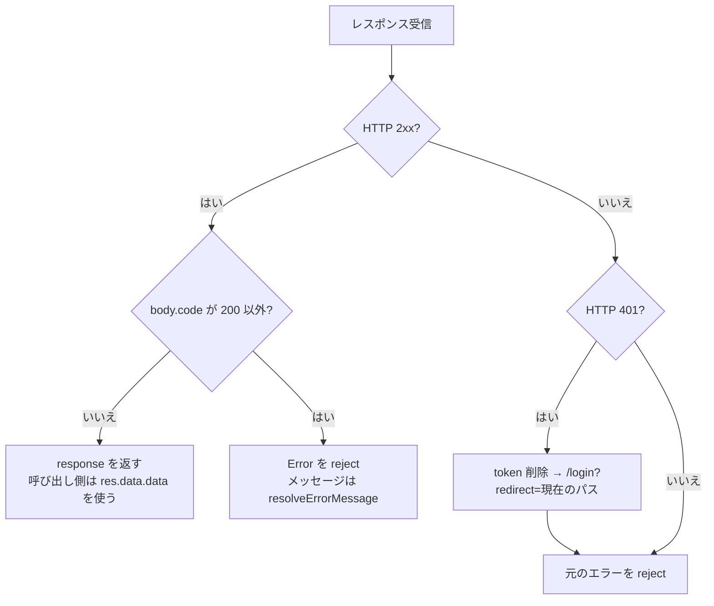

# フロントエンド API 設計書

[アーキテクチャ設計書](architecture.md) · [プロジェクト README](../../README.md) · [バックエンド API 設計書](../../manpower-kintai-backend/docs/api-design.md)

本書はフロントエンドからバックエンド API を呼び出す際の共通仕様（通信層・エラー処理・型定義）と、API モジュールとバックエンドエンドポイントの対応を記載する。エンドポイント自体の仕様（入力制約・権限・業務エラー）は[バックエンド API 設計書](../../manpower-kintai-backend/docs/api-design.md)を正とする。

## 1. 通信層（`src/api/common/request.ts`）

すべての API 呼び出しは共通の Axios インスタンスを経由する。

| 項目 | 設定 |
| --- | --- |
| `baseURL` | `VITE_API_BASE_URL`（`src/config/env.ts`）。未設定時は `''` |
| タイムアウト | 10,000 ms |
| 認証ヘッダー | リクエストインターセプターが `localStorage.token` を `Authorization: Bearer <token>` として付与 |
| その他ヘッダー | `Accept-Language`、`X-Trace-Id` は付与していない（バックエンド既定の日本語メッセージになる） |

### 1.1 レスポンス処理

バックエンドは業務エラーを **HTTP 200 + `code`** で返し、Spring Security の拒否だけを HTTP 401 / 403 で返す。フロントエンドは両方を次のように扱う。



`resolveErrorMessage` のメッセージ決定規則:

1. `data.errors`（バックエンドの `ValidationErrors`）があれば、各要素の `message`（なければ `key`）を最大 3 件、改行で連結する。
2. なければ `message`。
3. それもなければ `'Request failed'`。

HTTP 403（権限ルール不一致）は共通処理で遷移させず、呼び出し側に Axios エラーとして渡る。画面遷移時の権限不足はルートガードで事前に `/403` へ振り分ける。

### 1.2 呼び出し側の書き方

API 関数は Axios の `response` をそのまま返す。業務データは `res.data.data` にある。

```ts
import { fetchMonthlyTimesheet } from '@/api/timesheet'

try {
  const res = await fetchMonthlyTimesheet(2026, 9)
  timesheet.value = res.data.data
} catch (e) {
  ElMessage.error((e as Error).message)
}
```

## 2. 共通型（`src/types/common`）

```ts
interface ApiResponse<T> {
  code: number
  message?: string
  data: T
  traceId?: string
  timestamp?: number
  detail?: string        // dev 環境のみ返る
}

interface JoinPageResult<T> {  // 結合検索（部下・HR 社員一覧）
  records: T[]; total: number; pageNum: number; pageSize: number; pages: number
}
```

管理系一覧・通知・委譲候補で使う `PageResult<T>`（`page` / `size`）は `src/types/system` に定義されている。どちらの形式が返るかはエンドポイントごとに異なるため、バックエンド API 設計書の 1.7 節を参照する。

日付は `yyyy-MM-dd`、時刻は `HH:mm` の文字列で送受信する。列挙値（`RequestType`、`ApprovalStatus` 等）はバックエンドの code 文字列を TypeScript の文字列リテラル型で定義する（`src/types/attendance`）。

## 3. API モジュールとエンドポイントの対応

### 3.1 認証 `src/api/auth`

| 関数 | メソッド | パス | 戻り値 `data` | 利用箇所 |
| --- | --- | --- | --- | --- |
| `login(email, password)` | POST | `/api/system/auth/login` | `LoginResponse` | `authStore.login` |
| `fetchCurrentUser()` | GET | `/api/system/auth/me` | `CurrentUserResponse` | `authStore.loadCurrentUser`（ログイン直後・再読み込み時） |
| `logout()` | POST | `/api/system/auth/logout` | `void` | `authStore.logout` |

### 3.2 勤務表 `src/api/timesheet`

| 関数 | メソッド | パス | 戻り値 `data` | 利用画面 |
| --- | --- | --- | --- | --- |
| `fetchMonthlyTimesheet(year, month)` | GET | `/employee/att/timesheet?year&month` | `TimesheetMonth` | `TimesheetView` |
| `saveTimesheetRecord(data)` | PUT | `/employee/att/timesheet` | `void` | `TimesheetView` |
| `deleteTimesheetRecord(recordId)` | DELETE | `/employee/att/timesheet/{recordId}` | `void` | `TimesheetView` |

### 3.3 勤怠申請・承認 `src/api/attendance`

| 関数 | メソッド | パス | 戻り値 `data` | 利用画面 |
| --- | --- | --- | --- | --- |
| `fetchAttendanceRequests()` | GET | `/employee/att/requests` | `AttRequest[]` | `AttendanceRequestView` |
| `createAttendanceRequest(payload)` | POST | `/employee/att/requests` | `AttRequest` | 同上 |
| `updateAttendanceRequest(id, payload)` | PUT | `/employee/att/requests/{id}` | `AttRequest` | 同上 |
| `cancelAttendanceRequest(id)` | POST | `/employee/att/requests/{id}/cancel` | `void` | 同上 |
| `fetchPendingApprovals()` | GET | `/employee/approvals/pending` | `ApprovalInboxItem[]` | `ApprovalWorkspaceView` |
| `fetchApprovalHistory()` | GET | `/employee/approvals/history` | `ApprovalHistoryItem[]` | 同上 |
| `fetchApprovalDetail(id)` | GET | `/employee/approvals/{id}` | `ApprovalDetail` | 同上 |
| `approveRequest(id, comment)` | POST | `/employee/approvals/{id}/approve` | `void` | 同上 |
| `rejectRequest(id, comment)` | POST | `/employee/approvals/{id}/reject` | `void` | 同上 |
| `delegateRequest(id, targetApproverId)` | POST | `/employee/approvals/{id}/delegate` | `void` | 同上 |
| `searchApprovalDelegates(keyword)` | GET | `/employee/approval-delegates?keyword&page=1&size=20` | `PageResult<ApprovalDelegateCandidate>` | 同上 |

### 3.4 部門管理者 `src/api/manager`

| 関数 | メソッド | パス | 戻り値 `data` | 利用画面 |
| --- | --- | --- | --- | --- |
| `fetchSubordinates(params)` | GET | `/manager/emp/subordinates` | `JoinPageResult<SubordinateEmployee>` | `SubordinatesView` |
| `fetchSubordinateFilterOptions()` | GET | `/manager/emp/subordinates/options` | `SubordinateFilterOptionsResponse` | 同上 |

### 3.5 人事 `src/api/hr`

| 関数 | メソッド | パス | 戻り値 `data` | 利用画面 |
| --- | --- | --- | --- | --- |
| `fetchEmployeeDirectory(params)` | GET | `/hr/emp/employee` | `JoinPageResult<EmployeeDirectoryResponse>` | `EmployeeDirectoryView` |
| `fetchEmployeeDirectoryOptions()` | GET | `/hr/emp/employee/options` | `EmployeeDirectoryOptionsResponse` | 同上（バックエンドは暫定実装） |
| `fetchOnboardingOptions(companyId?)` | GET | `/admin/hr/onboarding/options` | `EmployeeOnboardingOptionsResponse` | `OnboardingView`（旧 API） |
| `onboardEmployee(payload)` | POST | `/hr/emp/employee/register` | `EmployeeOnboardingResponse` | `OnboardingView`（新 API） |

### 3.6 システム管理 `src/api/system`

| 関数 | メソッド | パス | 利用画面 |
| --- | --- | --- | --- |
| `fetchMenus` / `createMenu` / `updateMenu` / `deleteMenu` | GET / POST / PUT / DELETE | `/admin/sys/menus`、`/admin/sys/menus/{id}` | `MenuManagementView`、`PermissionManagementView`（メニュー参照） |
| `showMenu` / `hideMenu` / `enableMenu` / `disableMenu` | PUT | `/admin/sys/menus/{id}/show` 等 | `MenuManagementView` |
| `fetchPermissions` / `createPermission` / `updatePermission` / `deletePermission` | GET / POST / PUT / DELETE | `/admin/sys/permissions`、`/{id}` | `PermissionManagementView` |
| `enablePermission` / `disablePermission` | PUT | `/admin/sys/permissions/{id}/enable` 等 | 同上 |
| `fetchRoles` / `createRole` / `updateRole` / `deleteRole` | GET / POST / PUT / DELETE | `/admin/sys/roles`、`/{id}` | `RoleManagementView` |
| `enableRole` / `disableRole` | PUT | `/admin/sys/roles/{id}/enable` 等 | 同上 |
| `fetchRoleAuthorization` / `saveRoleAuthorization` | GET / PUT | `/admin/sys/roles/{id}/authorization` | 同上 |
| `fetchUnreadNotificationCount` | GET | `/employee/notifications/unread-count` | `SystemHeader` |
| `fetchUnreadNotifications` | GET | `/employee/notifications/unread` | `SystemHeader` |
| `markNotificationsAsRead(ids)` | PUT | `/employee/notifications/read` | `SystemHeader` |

バックエンドには存在するが、フロントエンドから呼び出していない API: `/admin/emp/**`（社員・アカウント・所属）、`/admin/org/**`（会社・組織・職級）、`/admin/sys/employee-roles`、`/admin/sys/enum-*`、`/admin/sys/i18n`、`/admin/wf/approval-rules`、`/employee/emp/**`、`/employee/org/**`、`/employee/sys/**`。

## 4. 新規 API 呼び出しの追加手順

1. バックエンド API 設計書でパス・メソッド・入出力・必要権限・ページ形式を確認する。
2. `src/types/<領域>/` に Request / Response 型を追加する（フィールド名はバックエンド DTO と一致させる）。
3. `src/api/<領域>/` に関数を追加し、`request.<method><ApiResponse<T>>(...)` で型付けする。画面から Axios を直接使わない。
4. 画面では `try / catch` でエラーメッセージを表示する（通信層は例外を投げるだけでトーストは出さない）。
5. 新しい画面の場合は、ルートの `meta.permission`、バックエンドの `sys_menu.path` と `sys_permission` の登録をそろえる。

## 5. 既知の課題

| 区分 | 内容 |
| --- | --- |
| HR | 入社登録画面が旧 API（選択肢）と新 API（登録）を混在して利用している。`/hr/emp/employee/options` は入社登録用の選択肢を返さない暫定実装 |
| 権限 | 初期データに `/hr/**` の権限ルールが無く、SUPER_ADMIN 以外は HR API が HTTP 403 になる |
| 型 | `src/types/hr` の `EnployeeDirectoryQueryParams` は綴り誤り（`Employee`） |
| ページ | `PageResult` と `JoinPageResult` がバックエンドに合わせて 2 種類存在する |
| 通信 | 401 以外（403・タイムアウト・ネットワークエラー）の共通処理が無い。`Accept-Language` を送っていないため、メッセージは常に日本語 |
| 追跡 | エラー表示に `X-Trace-Id` を出していないため、利用者の報告からサーバーログを特定しにくい |
