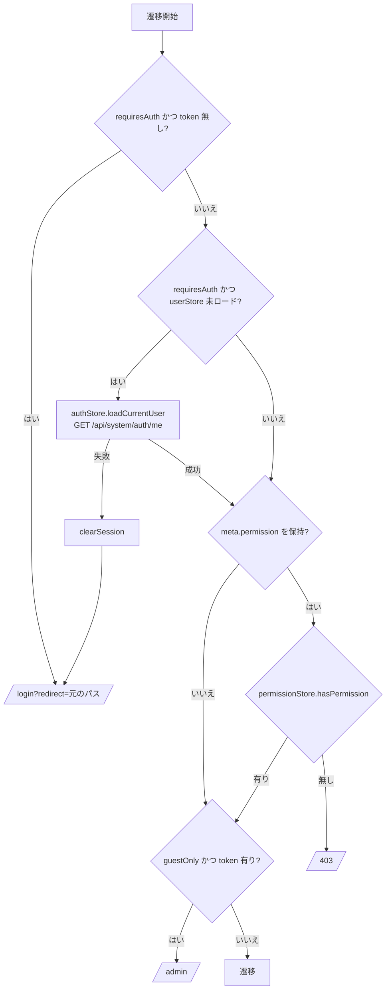
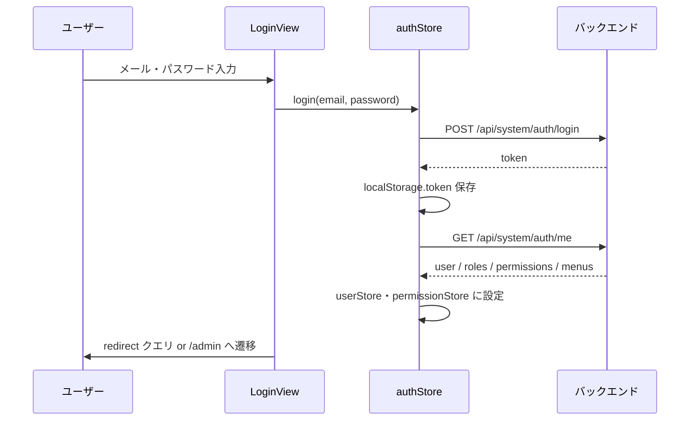

# フロントエンド アーキテクチャ設計書

[API 設計書](api-design.md) · [プロジェクト README](../../README.md) · [バックエンド アーキテクチャ](../../manpower-kintai-backend/docs/architecture.md)

本書は `manpower-kintai-frontend` の現行実装に基づく構成・画面・状態管理・権限制御を説明する。

## 1. 技術スタック

| 項目 | 採用技術 |
| --- | --- |
| フレームワーク | Vue 3（Composition API、`<script setup>`）+ TypeScript 6 |
| ビルド | Vite 8、`vite-plugin-vue-devtools` |
| ルーティング | Vue Router 5（`createWebHistory`） |
| 状態管理 | Pinia 3（Setup Store 形式） |
| UI | Element Plus 2（全体登録） |
| HTTP | Axios（共通インスタンス `src/api/common/request.ts`） |
| 静的解析 | `vue-tsc`（型検査）、oxlint + ESLint、Prettier |
| Node.js | `^20.19.0 \|\| >=22.12.0`（CI は Node 22） |

自動テスト（Vitest 等）は未導入。

## 2. ディレクトリ構成

```text
src/
├── main.ts              # アプリ起動（Pinia → Router → Element Plus → ディレクティブ）
├── App.vue              # <RouterView /> のみ
├── api/                 # バックエンド API 呼び出し（業務領域ごと）
│   ├── common/          # Axios インスタンスとインターセプター
│   ├── auth/            # ログイン・現在ユーザー・ログアウト
│   ├── timesheet/       # 勤務表
│   ├── attendance/      # 勤怠申請（requests）・承認（approvals）
│   ├── manager/         # 部下参照
│   ├── hr/              # 社員一覧・入社登録
│   └── system/          # メニュー・権限・ロール・通知
├── types/               # API の入出力型（api/ と同じ領域分割）+ enums
├── stores/              # Pinia: auth / user / permission
├── router/              # ルート定義とグローバルガード
├── components/layouts/  # SystemLayout / SystemHeader / SystemMain / SystemFooter / MenuItem
├── composables/         # usePermission、useBreadcrumb
├── directives/          # v-permission
├── utils/               # メニューツリー構築、申請量計算、権限検索条件
├── config/env.ts        # VITE_API_BASE_URL の読み取り
├── styles/global.css
└── views/               # 画面（業務領域ごと）
```

依存方向: `views` → `api` / `stores` / `composables` / `utils` → `types`。`api` はストアに依存せず、トークンは `localStorage` から直接読む。

## 3. 画面とルーティング

`/admin` 配下の画面は `SystemLayout`（ヘッダー・メニュー・メイン・フッター）の中に描画される。

| URL | ルート名 | 画面 | 必要権限（`meta.permission`） | 利用 API |
| --- | --- | --- | --- | --- |
| `/login`（別名 `/admin/login`） | `login` | `login/LoginView` | ゲストのみ | 認証 |
| `/admin` | `admin-home` | `DashboardView` | ログインのみ | - |
| `/admin/timesheet` | `timesheet` | `timesheet/TimesheetView` | `employee:timesheet:read` | 勤務表 |
| `/admin/requests` | `attendance-requests` | `requests/AttendanceRequestView` | `employee:request:read` | 勤怠申請 |
| `/admin/approvals` | `employee-approvals` | `approvals/ApprovalWorkspaceView` | `manager:approval:read` | 承認・委譲候補 |
| `/admin/subordinates` | `manager-subordinates` | `manager/SubordinatesView` | `manager:subordinate:read` | 部下参照 |
| `/admin/system/menus` | `system-menus` | `system/MenuManagementView` | `admin:menu:read` | メニュー管理 |
| `/admin/system/permissions` | `system-permissions` | `system/PermissionManagementView` | `admin:permission:read` | 権限管理・メニュー一覧 |
| `/admin/system/roles` | `system-roles` | `system/RoleManagementView` | `admin:role:read` | ロール管理・ロール認可 |
| `/hr/employee` | `hr-employee` | `hr/EmployeeDirectoryView` | `hr:employee:read` | HR 社員一覧 |
| `/hr/onboarding` | `hr-onboarding` | `hr/OnboardingView` | `hr:employee:onboard` | 入社登録 |
| `/403` | `forbidden` | `errors/ForbiddenView` | - | - |

`/`・`/dashboard`・未定義パスは `/admin` へリダイレクトする。全画面を静的 import しており、ルート単位の遅延読み込みは行っていない。

HR ルートは `/admin` の子として定義しているが、子パスを絶対パス `/hr` で書いているため URL は `/hr/...` になる（レイアウトは `SystemLayout` を共有）。

### 3.1 グローバルガード（`router.beforeEach`）



ページ再読み込み時はストアが空になるため、最初の認証必須ルートで `/me` を再取得してプロファイル・権限・メニューを復元する。

## 4. 状態管理

| ストア | 保持する状態 | 主な処理 |
| --- | --- | --- |
| `useAuthStore`（`stores/auth.ts`） | `token`（初期値は `localStorage.token`） | `login`（トークン保存 → `/me` 取得）、`loadCurrentUser`、`clearSession`、`logout`（API 呼び出し後に必ず `clearSession` → `/login`） |
| `useUserStore`（`stores/userStore.ts`） | `profile`（社員 ID・アカウント ID・会社 ID・社員番号・表示名・メール） | `isLoaded`、`displayName`、`email` |
| `usePermissionStore`（`stores/permissionStore.ts`） | `roles`、`permissions`、`menus` | `hasPermission`（`*` は全許可）、`hasRole`、`findMenuPath`（パンくず用） |

永続化するのは JWT（`localStorage.token`）のみ。プロファイル・権限・メニューはメモリ上にあり、再読み込み時に `/me` から復元する。

## 5. 認証とセッション



- リクエスト時はインターセプターが `Authorization: Bearer <token>` を付与する。
- HTTP 401 を受けると、インターセプターが `localStorage` のトークンを削除し、現在のパスを `redirect` に付けて `/login` へ遷移する。
- ログアウトはサーバー側で何もしないため、実質的にはクライアント側のトークン破棄で完結する。

## 6. 権限制御とメニュー

権限の源泉はすべて `GET /api/system/auth/me` の応答。フロントエンドの制御は表示制御であり、実際のアクセス制御はバックエンドの動的認可が行う。

| 仕組み | 実装 | 用途 |
| --- | --- | --- |
| ルート権限 | `meta.permission` + `router.beforeEach` | 画面単位の遷移可否（不可なら `/403`） |
| ディレクティブ | `v-permission="'code'"`、`v-permission="['a','b']"`（OR）、`v-permission="{ value: [...], mode: 'and' }"` | 要素の表示/非表示（`display: none`）。登録済みだが現状の画面では未使用 |
| コンポーザブル | `usePermission().hasPermission / hasAnyPermission / hasAllPermissions` | スクリプト内の分岐用。定義済みだが現状どこからも呼ばれていない |
| メニュー | `SystemHeader` が `buildVisibleMenuTree(permissionStore.menus)` でツリー化 | `visible !== 0` のメニューを `sort` 順で表示。`MenuItem` が `RouterLink` を描画 |

メニューはバックエンドの `sys_menu.path` をそのまま遷移先に使う。**`sys_menu.path` とフロントエンドのルート定義は手動で一致させる必要がある**（コンポーネントの動的解決は行っていない）。

## 7. レイアウトと共通 UI

- `SystemLayout`: `SystemHeader`（ナビゲーション・ユーザー情報・通知）、`SystemMain`（`<RouterView />`）、`SystemFooter` で構成。
- 通知: `SystemHeader` が `/employee/notifications/unread-count` と `/employee/notifications/unread` を取得し、既読化は `PUT /employee/notifications/read`。
- パンくず: `useBreadcrumb` が `permissionStore.findMenuPath` でメニュー階層を辿る仕組みとして定義されているが、現状どのコンポーネントからも使用されていない。
- 共通スタイルは `styles/global.css`、コンポーネントは Element Plus を基本とする。

## 8. 設定とビルド

| 項目 | 内容 |
| --- | --- |
| `VITE_API_BASE_URL` | API のベース URL。`.env.example` の既定は `http://localhost:8080`。未設定時は `''`（同一オリジン） |
| `.env.development.local` | `.env.example` をコピーして作成（Git 管理外） |
| Vite proxy | `/api` → `http://localhost:8080`。`VITE_API_BASE_URL` を空にした場合に `/api/system/auth/**` のみ proxy される |
| 別名 | `@` → `src` |

| コマンド | 内容 |
| --- | --- |
| `npm run dev` | 開発サーバー（既定 5173） |
| `npm run build` | `vue-tsc --build` と `vite build` を並列実行 |
| `npm run preview` | ビルド成果物のプレビュー |
| `npm run lint` | oxlint → ESLint（自動修正あり） |
| `npm run format` | Prettier で `src/` を整形 |

バックエンドの CORS 許可オリジンは `http://localhost:5173` のみ。別ポート・別ホストで起動する場合はバックエンド側の設定変更が必要。

## 9. 実装規約

- API 呼び出しは `src/api/<領域>/` に関数として定義し、画面から Axios を直接呼ばない。戻り値は `request.get<ApiResponse<T>>(...)` の形で型付けする。
- 入出力型は `src/types/<領域>/` に置き、バックエンドの DTO と同じフィールド名を使う。
- 新しい画面を追加する場合は、ルートの `meta.permission`、バックエンドの `sys_menu`（パス一致）と `sys_permission` をそろえる。

## 10. 既知の課題

| 区分 | 内容 |
| --- | --- |
| ルート/メニュー不一致 | 初期データの入社登録メニューのパスは `/admin/hr/onboarding` だが、ルートは `/hr/onboarding`。該当メニューからは未定義パスとして `/admin` にリダイレクトされる |
| 権限コード | `hr/EmployeeDirectoryView` の `hr:employee:read` は初期データの `sys_permission` に存在しない（SUPER_ADMIN の `*` でのみ表示可能） |
| HR API | 入社登録画面は選択肢を旧 API（`/admin/hr/onboarding/options`）、登録を新 API（`/hr/emp/employee/register`）から取得しており、新旧が混在している |
| エラー処理 | バックエンドの `ValidationErrors.errors[].message` を最大 3 件連結して `Error` として reject する。画面ごとの表示は各 View に任されている |
| 401 処理 | インターセプターが削除する `employeeId` / `displayName` / `email` キーは現在は保存されていない（旧実装の名残） |
| テスト | 自動テストが無い。CI は `npm ci` と `npm run build` のみ |
